# SikkerBox

[中文文档](README_CN.md)

## Overview

SikkerBox is a cross-platform multi-platform network toolkit that supports Android, ios, macos and windows access at the same time.

`Sikker` comes from the Norwegian word meaning `security` and `Box` stands for toolbox.

With a modern and clear UI layout and instructions, SikkerBox is designed to be the Swiss Army Knife of networking on your phone, providing a powerful and user-friendly security layer solution for your digital life.

SikkerBox currently implements the following features:

(1) Highly secure and reliable two-factor authentication (2FA), supporting more than 1000 websites and online apps that provide two-factor authentication, including github and gitlab.

(2) Port detection, supporting the detection of user's local public IP and Internet server port opening.

(3) IP address localization query, supporting the user's local public IP and Internet IP address localization query.

(4) Internationalized language support, complete support for Chinese and English interface switching, all tips and error messages have been internationalized.

SikkerBox will realize the following functions in the future:

(1) Wifi scanner.

(2) Ping diagnostic function according to user input domain name or IP.

(3) Domain name whois query function.

(4) DNS reverse lookup function.

(5) IP calculator function.

(6) Virtual Hosts function, according to the user from the device to select the hosts file, or edit the hosts file, and set the switch to turn on the function, to realize the network access priority read this hosts file.

## 2FA Features

- **Secure storage**: all account keys are encrypted and securely stored using a local Hive database, no data is transferred to any servers and all data remains on your device
- **Privacy-focused**: no analytics or tracking
- **QR code scanning**: Easily add accounts by scanning QR codes
- **Manual Entry**: Supports manual entry of account information
- **Time-based OTP**: Generate RFC 6238-compliant time-based one-time passwords (TOTP)/two-factor codes (2FA codes), with authentication codes automatically updated every 30 seconds.
- **Offline access**: works completely offline after setup is complete
- **Multi-platform support**: for Android, iOS, Windows, macOS, Linux and Web
- **Copy to Clipboard**: Quick copy function for easy CAPTCHA entry
- **Minimalist interface**: clean, intuitive modern style interface with a focus on ease of use

## Port Check Features

- Includes the function of automatically obtaining the user's public IP
- Provides a list of commonly used ports for quick one-click selection.
- Support detecting any port of any IP address
- Port detection results are displayed in different colors (open, closed, error), providing clear open/closed status feedback.
- Provide friendly loading indicators and error alerts.

## IP Address Location Query Features

- Realizes the function of automatically obtaining the user's public IP address.
- Supports users to input any IP address and query its attribution.
- The top area displays the user's current IP address and attribute.
- The middle area provides query form, input box with search icon and query button.
- The query result area clearly shows the queried IP and attribute information.
- Use different colors to indicate success and error status

## Getting Started

### Installation

Currently temporarily provide android apk installation package, just directly download the apk and install it.

download url:

https://sikkerbox.sourceforge.io

https://github.com/eagleos/sikkerbox

https://www.pgyer.com/VT9KrSgd

## Acknowledgments

- The Flutter team for their excellent framework
- All the package maintainers whose work made this project possible

## Github enable/configure/replace two-factor authentication (2FA)

### 2FA is not enabled

1. Download and install SikkerBox.

2. After logging in to Github, click on your avatar in the top right corner of the page, and then click Settings to enter the Settings page.

3. Click Password and authentication in the Access menu on the left, and then click Enable two-factor authentication in the Two-Factor authentication area.

4. Open SikkerBox, click the scanning icon at the bottom right corner of the app, and point it at the QR code that appears on Github as mentioned above. After successful scanning, it will be automatically added to the account list in the main interface.

5. Click the corresponding Github account in the account list of the main interface of SikkerBox, you can see the one-time password, return to the Github page and enter the one-time password in the Verify the code from the app box below the QR code, after verification, it will automatically jump to the Download your recovery codes page, make sure to download and download your recovery codes. Once verified, you will be redirected to the Download your recovery codes page, so be sure to download and save your recovery codes in a safe place.

6. Then, click the I have saved my recovery codes button, and then click the Done button on the page that appears.

7. The next time you log in to Github again, or if you are asked to enter your 2FA credentials when logging in to Github on another device, open SikkerBox, click the corresponding Github account in the account list of the main interface of SikkerBox, and then go to the One-Time Passwords page, and then enter the One-Time Passwords to log in successfully.

### Replace 2FA app

1. Download and install SikkerBox.

2. After successfully logging in to Github using the original 2FA app, click on your avatar at the top right corner of the page, and then click Settings to enter the Settings page.

3. Click Password and authentication in the Access menu on the left, and then in the Two-factor methods area of [Two-factor authentication], click the Edit button to the right of Authenticator app(Configured). button to the right of Authenticator ap (Configured).

4. Open SikkerBox, click the scanning icon at the bottom right corner of the app, and point it at the QR code on Github as mentioned above. After successful scanning, it will be automatically added to your account list in the main interface.

5. Click the corresponding Github account in the account list of the main interface of SikkerBox, and you can see the one-time password, return to the Github page and enter the one-time password in the Verify the code from the app box below the QR code, and click Save button to complete the replacement of the 2FA app after verification.

## FAQ

1. I accidentally deleted my account in SikkerBox and can't login to Github with 2FA authentication, what should I do?

A: Use the Github recovery code to successfully log in to Github, and then use the above steps to replace the 2FA app to rebind SikkerBox.

## Contributors

Contributors are welcome to participate in the testing of this app and will be listed in the table below as a token of our appreciation!

| Phone Models | Test Versions | Test Results | Latest Test Time | Testers |
|--------------------|-------|-------|------------| -------|
| vivo IQOO Neo5     | 1.0.1 |✅| 2025.05.19 |eagle|
| vivo IQOO Neo5 活力版 | 1.0.1  |✅| 2025.05.19 |eagle|

We are always trying to improve our app! Let us know if you have any suggestions or feedback - we'd love to hear from you!

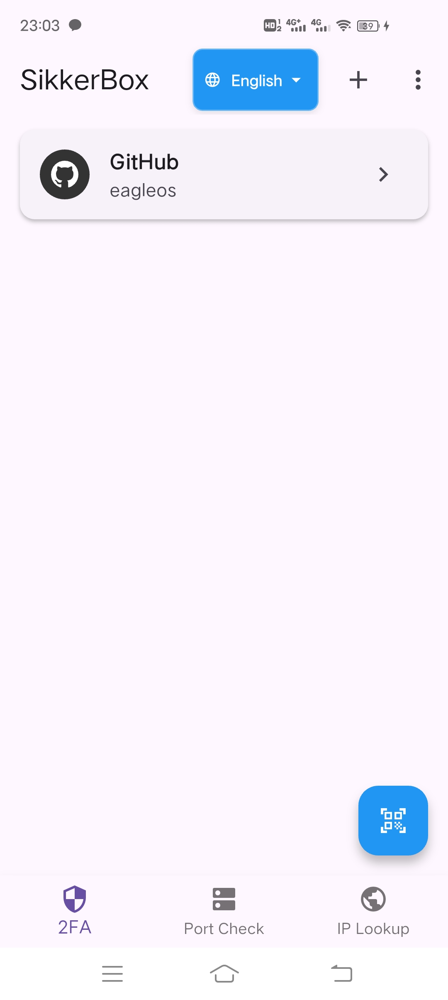
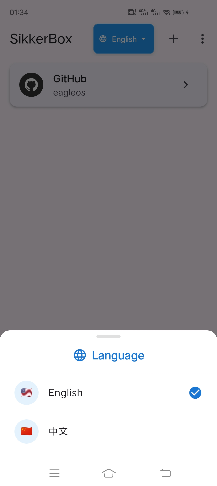
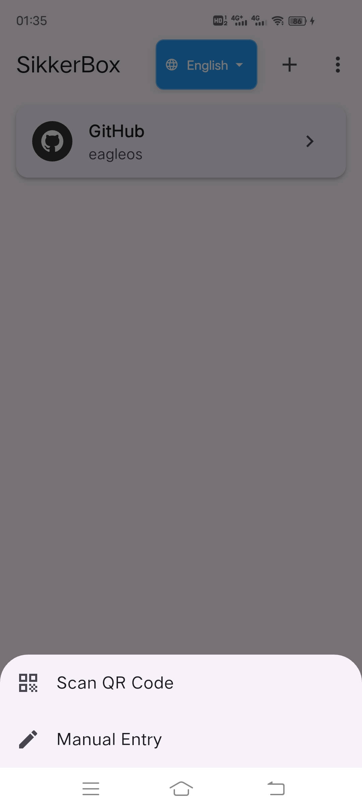
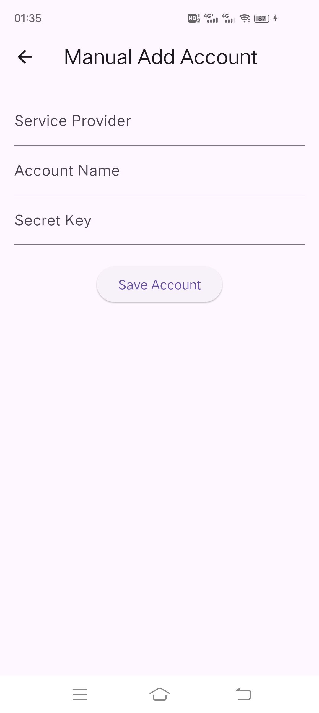
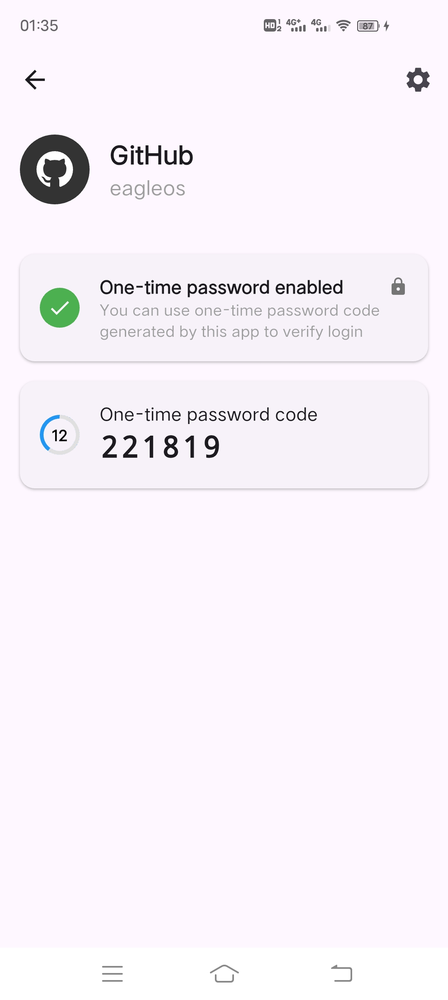
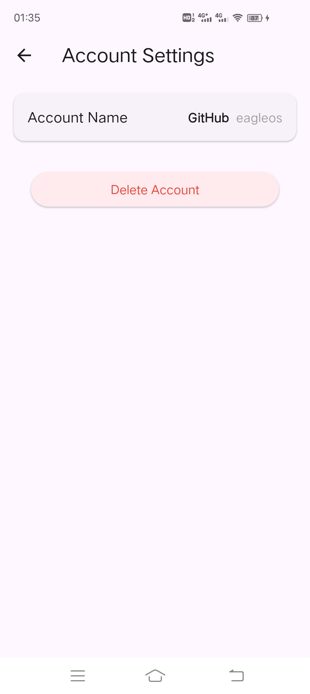
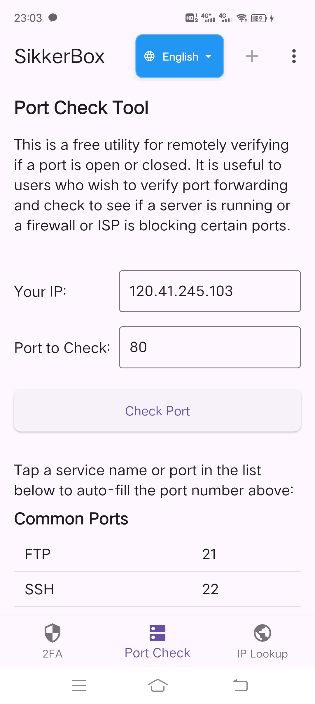
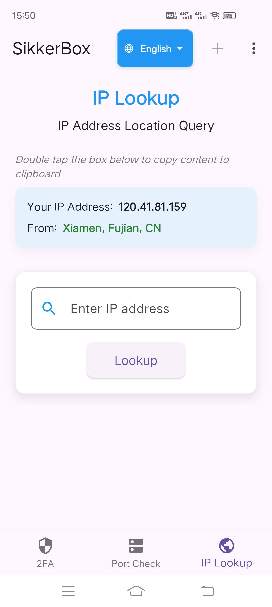
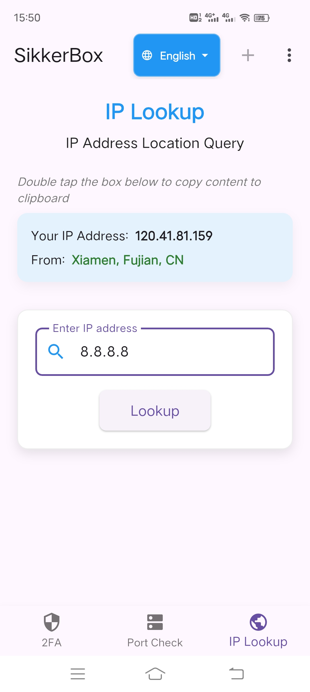
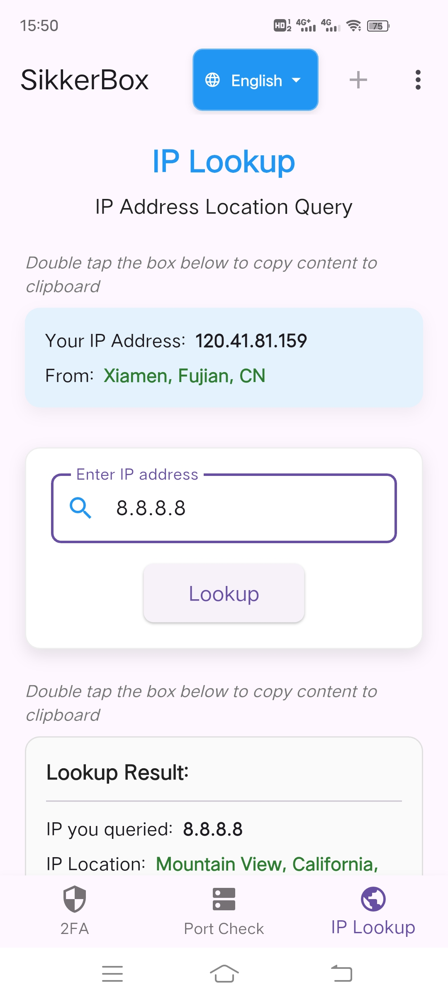
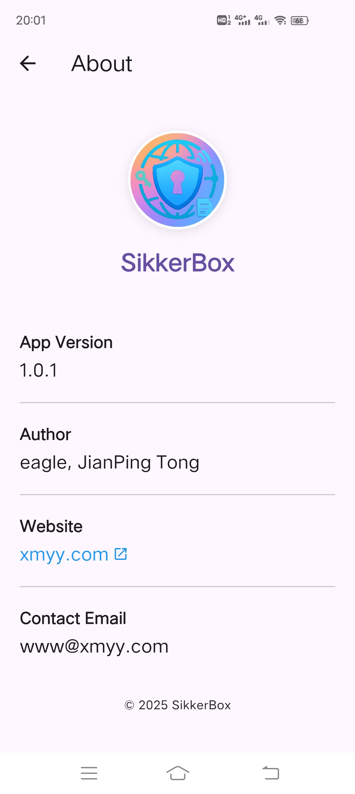
