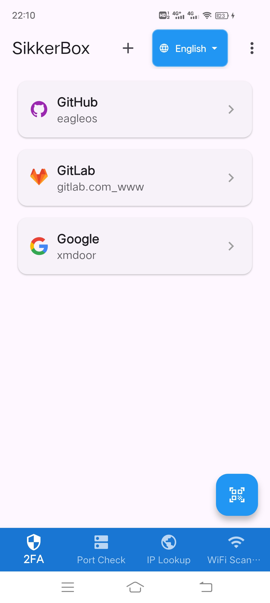
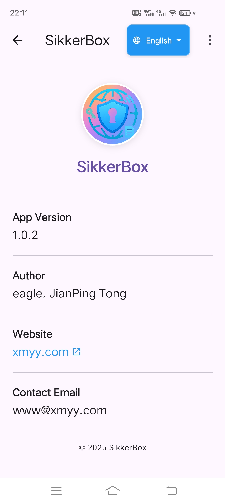

# SikkerBox

[中文文档](README_CN.md)

## Overview

SikkerBox is a comprehensive security and network utility application designed to provide users with essential security tools and network diagnostics in one convenient package.

`Sikker` comes from the Norwegian word meaning `security` and `Box` stands for toolbox.

With cross-platform compatibility, SikkerBox combines two-factor authentication (2FA) management with a robust suite of network diagnostic tools.

With a modern and clear UI layout and instructions, SikkerBox is designed to be the Swiss Army Knife of networking on your phone, providing a powerful and user-friendly security layer solution for your digital life.

## Key Features

### Two-Factor Authentication (2FA)

Highly secure and reliable two-factor authentication (2FA), supporting more than 1000 websites and online apps that provide two-factor authentication, including github, gitlab, google, etc. .

- **Secure Account Management**: Store and manage your 2FA accounts securely with encryption
- **QR Code Scanning**: Easily add new accounts by scanning QR codes
- **Manual Entry Support**: Supports manual entry of account information
- **Time-Based One-Time Passwords (TOTP)**: Generate secure, RFC 6238-compliant, time-based one-time passwords (TOTP)/two-factor codes (2FA codes), with authentication codes automatically updated every 30 seconds.
- **Offline access**: works completely offline after setup is complete
- **Visual Customization**: Accounts display with service favicons for easy identification

### Network Diagnostic Tools

SikkerBox includes a comprehensive suite of network utilities:

- **Port Checker**: Verify if specific ports are open or closed on any IP address, provides a list of commonly used ports for quick one-click selection.
- **IP Location Lookup**: Determine the geographical location of any IP address, includes the function of automatically obtaining the user's public IP
- **WiFi Scanner**: Analyze nearby WiFi networks, including signal strength, channels, and security information
- **Ping Diagnostic**: Test connectivity to domains or IP addresses
- **Whois Lookup**: Query registration information for any domain name
- **DNS Reverse Lookup**: Find hostnames associated with IP addresses
- **More features**：Stay tuned for more features

## User Experience

- **Multi-language Support**: Complete support for Chinese and English interface switching, all tips and error messages have been internationalized
- **Modern Material Design**: Clean, intuitive modern style interface with Material Design 3, and a focus on ease of use
- **Responsive Layout**: Optimized for various screen sizes
- **Clipboard Integration**: Most features support copy and paste to clipboard
- **Dark Mode Support**: Comfortable viewing in low-light environments
- **Friendly reminder**: Most pages provide friendly loading indicators and error alerts.

## Technical Details

- **Cross-Platform support**: for Android, iOS, Windows, macOS, Linux and Web
- **Secure Storage**: all account keys are encrypted and securely stored using a local Hive database, no data is transferred to any servers and all sensitive data remains on your device
- **Low Resource Usage**: Optimized for minimal battery and memory consumption

## Privacy and Security

SikkerBox prioritizes your privacy and security:

- **No Account Required**: Use all features without creating an account
- **Privacy-focused**: no analytics or tracking
- **No Data Collection**: Your 2FA secrets and network diagnostics remain on your device
- **Open Network APIs**: Network tools use open APIs for diagnostics without compromising privacy

## Use Cases

- **Security Professionals**: Validate network configurations and security settings
- **IT Administrators**: Diagnose network issues and verify server configurations
- **Developers**: Test application connectivity and network functionality
- **Privacy-Conscious Users**: Manage 2FA accounts without relying on third-party services

## Requirements

- Android 5.0 (Lollipop) or higher
- iOS 11.0 or higher
- For desktop: Windows 10+, macOS 10.14+, or Linux with GTK 3

## Getting Started

### Installation

Currently temporarily provide android apk installation package, just directly download the apk and install it.

download url:

https://sikkerbox.sourceforge.io

https://github.com/eagleos/sikkerbox

https://www.pgyer.com/VT9KrSgd

## Acknowledgments

- The Flutter team for their excellent framework
- All the package maintainers whose work made this project possible

## Github enable/configure/replace two-factor authentication (2FA)

### 2FA is not enabled

1. Download and install SikkerBox.

2. After logging in to Github, click on your avatar in the top right corner of the page, and then click Settings to enter the Settings page.

3. Click Password and authentication in the Access menu on the left, and then click Enable two-factor authentication in the Two-Factor authentication area.

4. Open SikkerBox, click the scanning icon at the bottom right corner of the app, and point it at the QR code that appears on Github as mentioned above. After successful scanning, it will be automatically added to the account list in the main interface.

5. Click the corresponding Github account in the account list of the main interface of SikkerBox, you can see the one-time password, return to the Github page and enter the one-time password in the Verify the code from the app box below the QR code, after verification, it will automatically jump to the Download your recovery codes page, make sure to download and download your recovery codes. Once verified, you will be redirected to the Download your recovery codes page, so be sure to download and save your recovery codes in a safe place.

6. Then, click the I have saved my recovery codes button, and then click the Done button on the page that appears.

7. The next time you log in to Github again, or if you are asked to enter your 2FA credentials when logging in to Github on another device, open SikkerBox, click the corresponding Github account in the account list of the main interface of SikkerBox, and then go to the One-Time Passwords page, and then enter the One-Time Passwords to log in successfully.

### Replace 2FA app

1. Download and install SikkerBox.

2. After successfully logging in to Github using the original 2FA app, click on your avatar at the top right corner of the page, and then click Settings to enter the Settings page.

3. Click Password and authentication in the Access menu on the left, and then in the Two-factor methods area of [Two-factor authentication], click the Edit button to the right of Authenticator app(Configured). button to the right of Authenticator ap (Configured).

4. Open SikkerBox, click the scanning icon at the bottom right corner of the app, and point it at the QR code on Github as mentioned above. After successful scanning, it will be automatically added to your account list in the main interface.

5. Click the corresponding Github account in the account list of the main interface of SikkerBox, and you can see the one-time password, return to the Github page and enter the one-time password in the Verify the code from the app box below the QR code, and click Save button to complete the replacement of the 2FA app after verification.

## FAQ

1. I accidentally deleted my account in SikkerBox and can't login to Github with 2FA authentication, what should I do?

A: Use the Github recovery code to successfully log in to Github, and then use the above steps to replace the 2FA app to rebind SikkerBox.

## Contributors

Contributors are welcome to participate in the testing of this app and will be listed in the table below as a token of our appreciation!

| Phone Models | Test Versions | Test Results | Latest Test Time | Testers |
|--------------------|---------------|-------|------------------| -------|
| vivo IQOO Neo5     | 1.0.2         |✅| 2025.05.27       |eagle|
| vivo IQOO Neo5 活力版 | 1.0.2         |✅| 2025.05.27       |eagle|

We are always trying to improve our app! Let us know if you have any suggestions or feedback - we'd love to hear from you!

