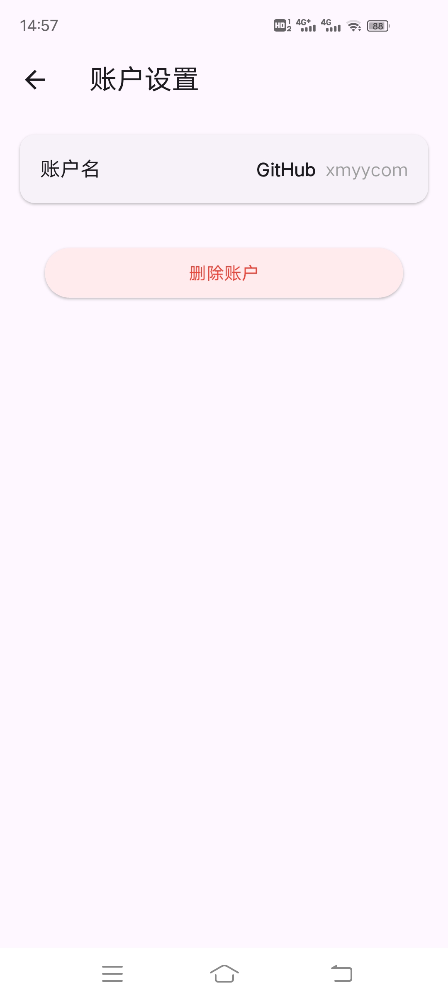
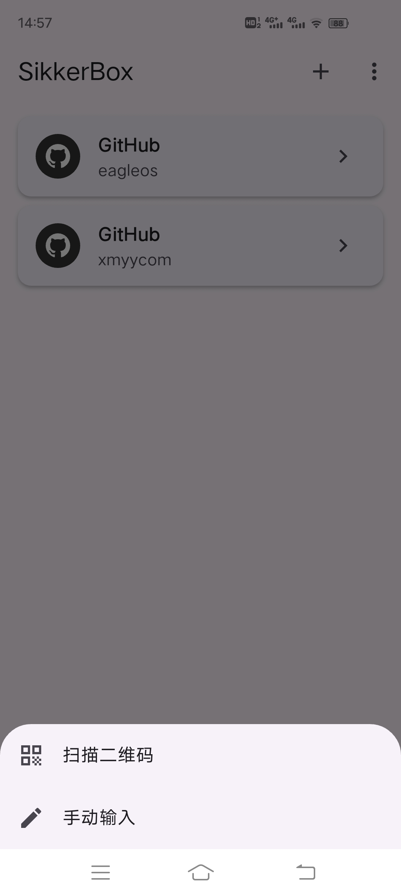

# SikkerBox

[中文文档](./README_CN.md)

## Overview

SikkerBox is a cross-platform multi-platform network toolkit that simultaneously supports Android, ios, macos, and windows access, and will realize the following functions:

(1) 2FA authentication function of Microsoft Authenticator authentication class APP, allowing adding github and other information to realize 2FA authentication.

(2) Ping diagnostic function based on user input domain name or IP.

(3) Domain whois query function.

(4) DNS reverse lookup function.

(5) IP calculator function.

(6) Virtual Hosts function, according to the user from the device to select the hosts file, or edit the hosts file, and set the switch to enable the function, to realize the network access priority read the hosts file.

Currently, the function of point (1) above has been realized, i.e., it realizes secure two-factor authentication (2FA), which can generate time-based one-time passwords (TOTP) for your online accounts, and provides a powerful and user-friendly extra security layer solution for your digital life.

## 2FA Features

- **Secure Storage**: All account secrets are encrypted and stored securely using Hive database
- **QR Code Scanning**: Easily add accounts by scanning QR codes
- **Manual Entry**: Support for manually entering account information
- **Time-Based OTP**: Generate time-based one-time passwords (TOTP) compliant with RFC 6238
- **Offline Access**: Works completely offline after setup
- **Multi-Platform Support**: Available for Android, iOS, Windows, macOS, Linux, and web
- **Copy to Clipboard**: Quick copy functionality for easy code entry
- **Error Handling**: Robust error handling with detailed logging
- **Minimalist UI**: Clean, intuitive interface focused on usability

## 2FA Technical Details

SikkerBox is built using Flutter and follows these key principles:

- **Security First**: No data is transmitted to any server; all data remains on your device
- **Privacy Focused**: No analytics or tracking
- **Open Source**: Transparent codebase available for review
- **Modern Architecture**: Utilizes Provider pattern for state management
- **Clean Code**: Well-structured codebase with clear separation of concerns

## Getting Started

### Installation

Currently temporarily provide android apk installation package, just directly download the apk and install it.

## Acknowledgments

- The Flutter team for their excellent framework
- All the package maintainers whose work made this project possible

## Github enable/configure/replace two-factor authentication (2FA)

### 2FA is not enabled

1. Download and install SikkerBox.

2. After logging in to Github, click on your avatar in the top right corner of the page, and then click Settings to enter the Settings page. 3.

3. Click Password and authentication in the Access menu on the left, and then click Enable two-factor authentication in the Two-Factor authentication area.

4. Open SikkerBox, click the scanning icon at the bottom right corner of the app, and point it at the QR code that appears on Github as mentioned above. After successful scanning, it will be automatically added to the account list in the main interface. 5.

5. Click the corresponding Github account in the account list of the main interface of SikkerBox, you can see the one-time password, return to the Github page and enter the one-time password in the Verify the code from the app box below the QR code, after verification, it will automatically jump to the Download your recovery codes page, make sure to download and download your recovery codes. Once verified, you will be redirected to the Download your recovery codes page, so be sure to download and save your recovery codes in a safe place.

6. Then, click the I have saved my recovery codes button, and then click the Done button on the page that appears.

7. The next time you log in to Github again, or if you are asked to enter your 2FA credentials when logging in to Github on another device, open SikkerBox, click the corresponding Github account in the account list of the main interface of SikkerBox, and then go to the One-Time Passwords page, and then enter the One-Time Passwords to log in successfully.

### Replace 2FA app

1. Download and install SikkerBox.

2. After successfully logging in to Github using the original 2FA app, click on your avatar at the top right corner of the page, and then click Settings to enter the Settings page. 3.

3. Click Password and authentication in the Access menu on the left, and then in the Two-factor methods area of [Two-factor authentication], click the Edit button to the right of Authenticator ap(Configured). button to the right of Authenticator ap (Configured).

4. Open SikkerBox, click the scanning icon at the bottom right corner of the app, and point it at the QR code on Github as mentioned above. After successful scanning, it will be automatically added to your account list in the main interface.

5. Click the corresponding Github account in the account list of the main interface of SikkerBox, and you can see the one-time password, return to the Github page and enter the one-time password in the Verify the code from the app box below the QR code, and click Save button to complete the replacement of the 2FA app after verification.

## FAQ

1. I accidentally deleted my account in SikkerBox and can't login to Github with 2FA authentication, what should I do?

A: Use the Github recovery code to successfully log in to Github, and then use the above steps to replace the 2FA app to rebind SikkerBox.

