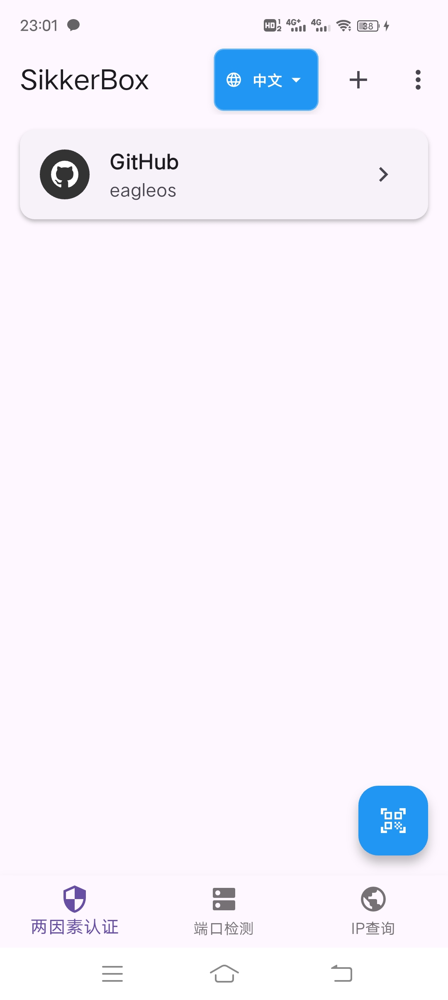
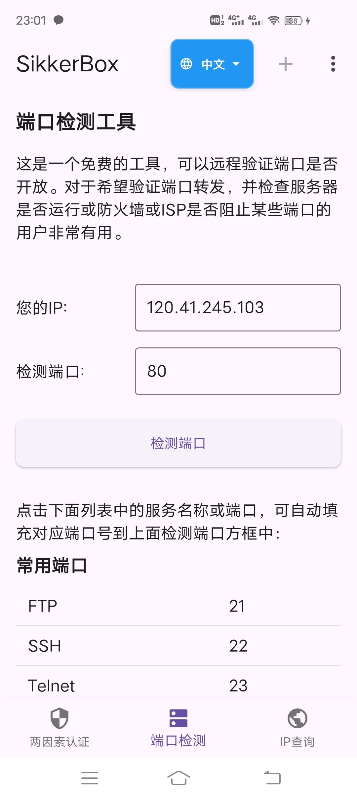
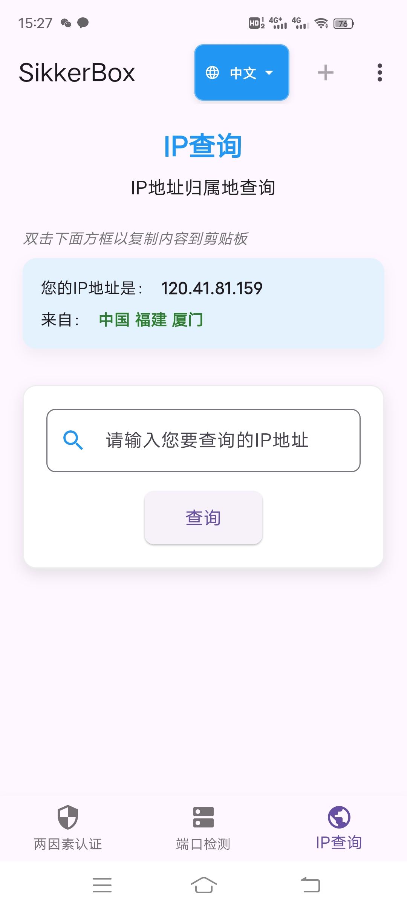
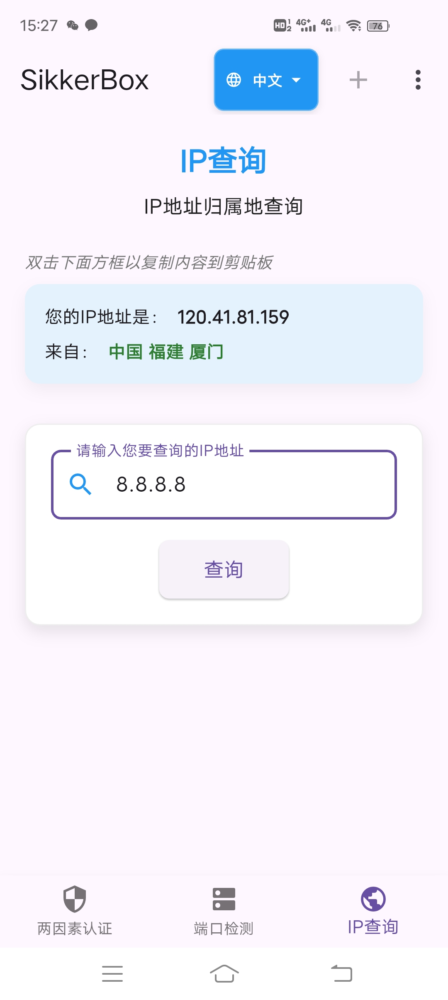
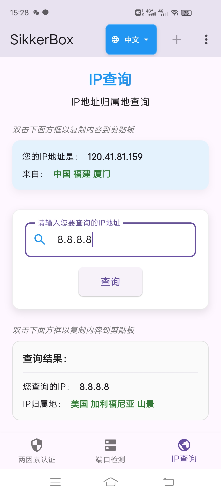
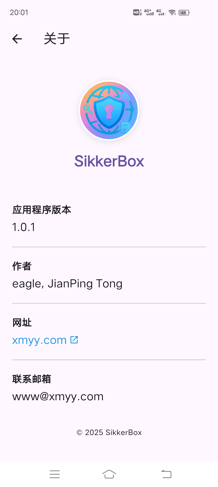

# SikkerBox

[English Documentation](README.md)

## 概述

SikkerBox 是一个同时支持安卓端、ios端、macos端、windows端访问的跨平台多平台网络工具包。

`Sikker`源于挪威语，意为`安全`，`Box`代表工具箱。

SikkerBox 采用现代、清晰的UI界面布局和指示，旨在打造成手机上的网络瑞士军刀，为您的数字生活提供一个功能强大且用户友好的安全层解决方案。

SikkerBox 目前已实现如下功能：

（1）高度安全可靠的双因素身份验证 (2FA)，支持包括github、gitlab在内的超过 1000 多种提供双因素身份登录验证的网站和在线App。

（2）端口检测，支持用户本机公网IP及互联网服务器端口开放检测。

（3）IP地址归属地查询，支持用户本机公网IP及互联网IP地址归属地查询。

（4）国际化语言支持，完整支持中英文界面切换，所有提示和错误信息均已国际化。

SikkerBox 未来将实现如下功能：

（1）Wifi扫描器。

（2）根据用户输入域名或IP进行Ping诊断功能。

（3）域名whois查询功能。

（4）DNS反查功能。

（5）IP计算器功能。

（6）Virtual Hosts功能，根据用户从本设备选择hosts文件，或编辑hosts文件，并设置开关开启功能，实现网络访问时优先读取此hosts文件。

## 2FA 功能特点

- **安全存储**：所有账户密钥均使用本地 Hive 数据库进行加密和安全存储，不向任何服务器传输数据，所有数据保留在您的设备上
- **注重隐私**：无分析或跟踪
- **二维码扫描**：通过扫描二维码轻松添加账户
- **手动输入**：支持手动输入账户信息
- **基于时间的 OTP**：生成符合 RFC 6238 标准的基于时间的一次性密码（TOTP）/双因素代码 (2FA 代码)，验证码每 30 秒自动更新一次。
- **离线访问**：设置完成后完全离线工作
- **多平台支持**：适用于 Android、iOS、Windows、macOS、Linux 和 Web
- **复制到剪贴板**：快速复制功能，方便输入验证码
- **极简界面**：干净、直观的现代风格界面，注重易用性

## 端口检测 功能特点

- 包含自动获取用户公网IP的功能
- 提供常用端口列表供用户快速一键选择
- 支持检测任意IP地址的任意端口
- 端口检测结果使用不同颜色进行显示（开放、关闭、错误），提供明确的开放/关闭状态反馈
- 提供友好的加载指示器和错误提示

## IP地址归属地查询 功能特点

- 实现了自动获取用户公网IP地址的功能
- 支持用户输入任意IP地址并查询其归属地
- 顶部区域显示用户当前IP和归属地
- 中间区域提供查询表单，带搜索图标的输入框和查询按钮
- 查询结果区域清晰展示所查询的IP和归属地信息
- 使用不同颜色提示成功和错误状态

## 开始使用

### 安装

目前暂时提供安卓端apk安装包，直接下载apk安装即可。

下载地址：

https://sikkerbox.sourceforge.io

https://github.com/eagleos/sikkerbox

https://www.pgyer.com/VT9KrSgd

## 致谢

- Flutter 团队提供的优秀框架
- 所有使本项目成为可能的软件包维护者 

## Github 开启/配置/更换 two-factor authentication (2FA) 双因素认证

### 未开启2FA

1. 下载并安装SikkerBox。

2. 登录Github后，点击页面最右上角的头像，再点击Settings进入设置页面。

3. 再在左侧Access菜单中点击Password and authentication，然后在【Two-factor authentication】区域点击Enable two-factor authentication（启用双重身份验证）按钮。

4. 打开SikkerBox，直接点击app右下角的扫描图标，对准上述Github出现的二维码。扫描成功后自动添加到主界面的账户列表中。

5. 在SikkerBox主界面账户列表中点击对应的Github账号，进去可查看到一次性密码，返回Github页面在二维码下面的Verify the code from the app方框中输入此一次性密码，验证通过后会自动跳转到Download your recovery codes页面，务必下载并将恢复码保存在安全的地方。

6. 然后，点击I have saved my recovery codes按钮，在出现的另一页面中点击Done按钮，即完成开启2FA。

7. 下次如果重新登录Github，或者在另外设备上登录Github要求输入2FA认证吗时，打开SikkerBox，在SikkerBox主界面账户列表中点击对应的Github账号，进去可查看到一次性密码，输入此一次性密码即可登录成功。

### 更换2FA app

1. 下载并安装SikkerBox。

2. 使用原有2FA app成功登录Github后，点击页面最右上角的头像，再点击Settings进入设置页面。

3. 再在左侧Access菜单中点击Password and authentication，然后在【Two-factor authentication】的Two-factor methods区域，点击Authenticator app(Configured)右边的Edit按钮。

4. 打开SikkerBox，直接点击app右下角的扫描图标，对准上述Github出现的二维码。扫描成功后自动添加到主界面的账户列表中。

5. 在SikkerBox主界面账户列表中点击对应的Github账号，进去可查看到一次性密码，返回Github页面在二维码下面的Verify the code from the app方框中输入此一次性密码，验证通过后点击Save保存按钮即可完成2FA app替换。

## FAQ

1. 在SikkerBox中不小心删除账户，无法进行2FA认证登录Github，怎么办？

答：使用Github恢复码成功登录Github，然后使用上述更换2FA app步骤重新绑定SikkerBox即可。

## 贡献者

欢迎参与本app测试，参与者将会在下面表格中列出以示感谢！

| 手机机型               | 测试版本  |   测试结果  | 最新测试时间     | 测试者   |
|--------------------|-------|-------|------------| -------|
| vivo IQOO Neo5     | 1.0.1 |✅| 2025.05.19 |eagle|
| vivo IQOO Neo5 活力版 | 1.0.1  |✅| 2025.05.19 |eagle|

我们一直在努力改进我们的应用！有任何建议或反馈，请告诉我们——我们很乐意听取您的意见！

