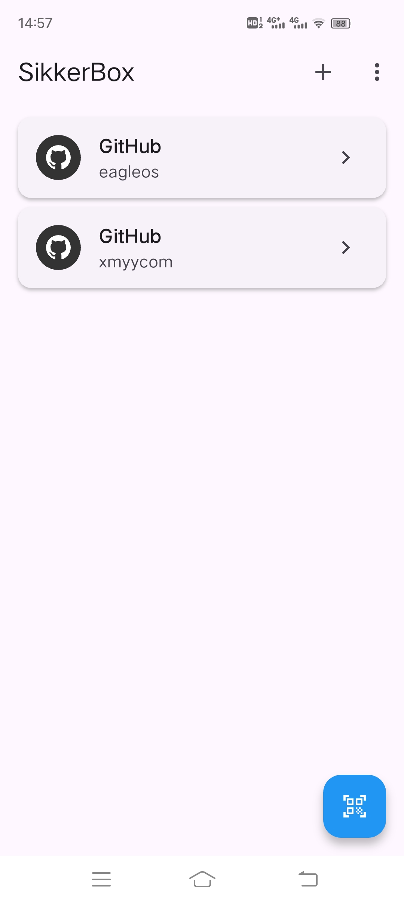
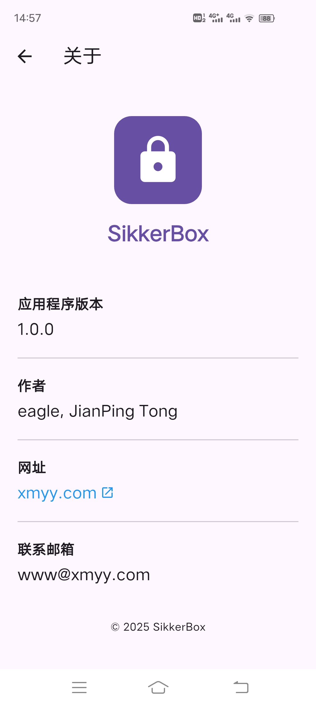
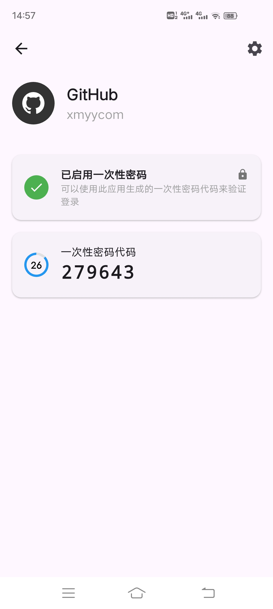
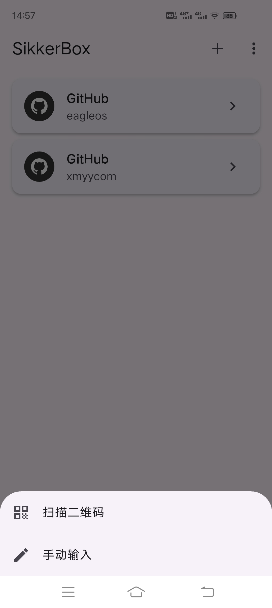

# SikkerBox

[English Documentation](./README.md)

## 概述

SikkerBox 是一个同时支持安卓端、ios端、macos端、windows端访问的跨平台多平台网络工具包，将实现如下功能：
（1）Microsoft Authenticator身份验证类APP的2FA认证功能，允许添加github等信息实现2FA认证。
（2）根据用户输入域名或IP进行Ping诊断功能。
（3）域名whois查询功能。
（4）DNS反查功能。
（5）IP计算器功能。
（6）Virtual Hosts功能，根据用户从本设备选择hosts文件，或编辑hosts文件，并设置开关开启功能，实现网络访问时优先读取此hosts文件。

目前已实现上述第（1）点功能，即实现了安全的双因素认证（2FA），可为您的在线账户生成基于时间的一次性密码（TOTP），为您的数字生活提供了一个强大且用户友好的额外安全层解决方案。

## 2FA 功能特点

- **安全存储**：所有账户密钥均使用 Hive 数据库进行加密和安全存储
- **二维码扫描**：通过扫描二维码轻松添加账户
- **手动输入**：支持手动输入账户信息
- **基于时间的 OTP**：生成符合 RFC 6238 标准的基于时间的一次性密码
- **离线访问**：设置完成后完全离线工作
- **多平台支持**：适用于 Android、iOS、Windows、macOS、Linux 和 Web
- **复制到剪贴板**：快速复制功能，方便输入验证码
- **错误处理**：具有详细日志记录的强大错误处理机制
- **极简界面**：干净、直观的界面，注重易用性

## 2FA 技术细节

SikkerBox 使用 Flutter 构建，遵循以下关键原则：

- **安全第一**：不向任何服务器传输数据；所有数据保留在您的设备上
- **注重隐私**：无分析或跟踪
- **开源**：透明的代码库可供审查
- **现代架构**：使用 Provider 模式进行状态管理
- **整洁代码**：结构良好的代码库，关注点分离清晰

## 开始使用

### 安装

目前暂时提供安卓端apk安装包，直接下载apk安装即可。

## 致谢

- Flutter 团队提供的优秀框架
- 所有使本项目成为可能的软件包维护者 

