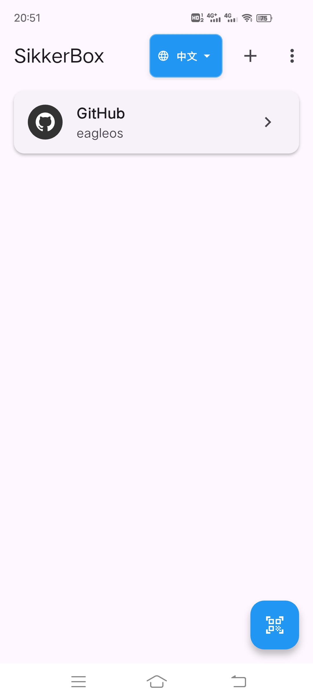
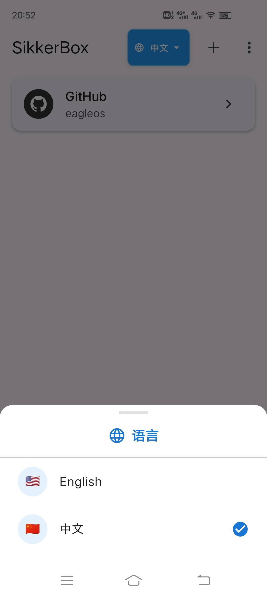
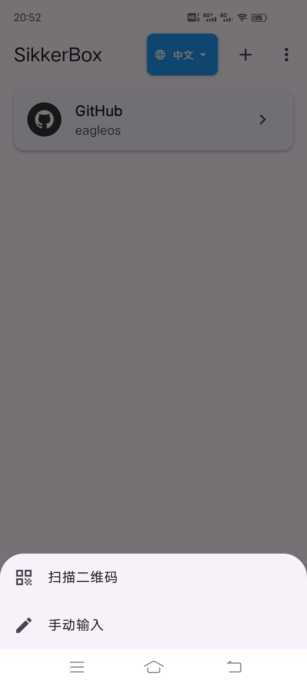
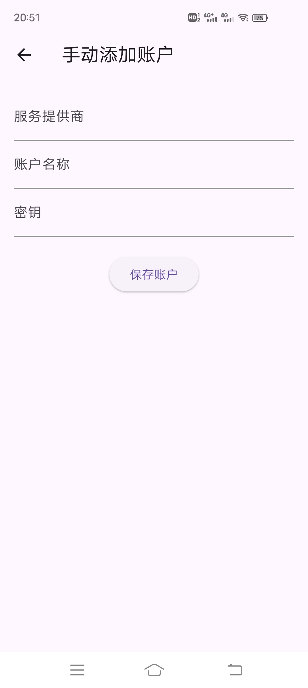
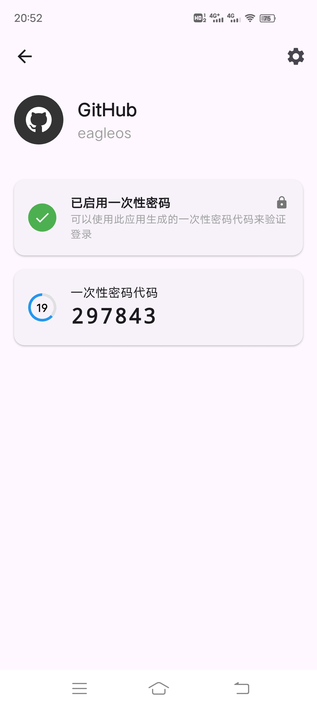
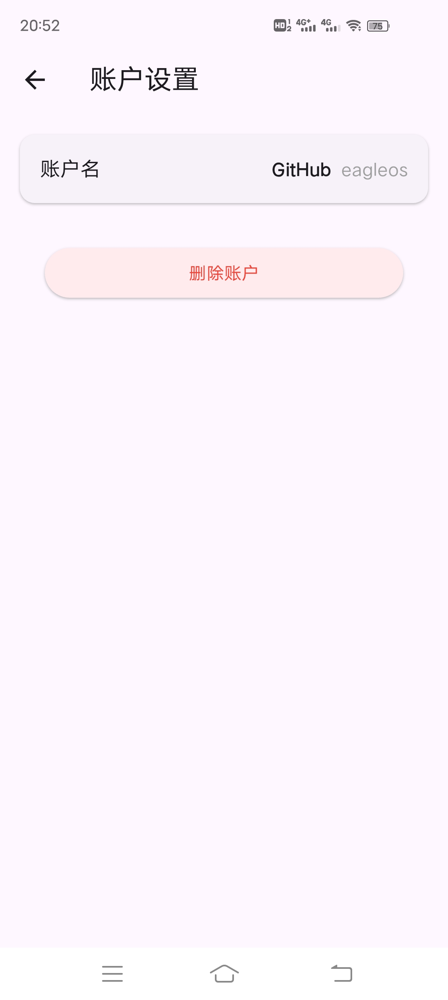

# SikkerBox

[English Documentation](./README.md)

## 概述

SikkerBox 是一个同时支持安卓端、ios端、macos端、windows端访问的跨平台多平台网络工具包，将实现如下功能：

（1）Microsoft Authenticator身份验证类APP的2FA认证功能，允许添加github等信息实现2FA认证。

（2）根据用户输入域名或IP进行Ping诊断功能。

（3）域名whois查询功能。

（4）DNS反查功能。

（5）IP计算器功能。

（6）Virtual Hosts功能，根据用户从本设备选择hosts文件，或编辑hosts文件，并设置开关开启功能，实现网络访问时优先读取此hosts文件。

目前已实现上述第（1）点功能，即实现了安全的双因素认证（2FA），可为您的在线账户生成基于时间的一次性密码（TOTP），为您的数字生活提供了一个强大且用户友好的额外安全层解决方案。

## 2FA 功能特点

- **安全存储**：所有账户密钥均使用 Hive 数据库进行加密和安全存储
- **二维码扫描**：通过扫描二维码轻松添加账户
- **手动输入**：支持手动输入账户信息
- **基于时间的 OTP**：生成符合 RFC 6238 标准的基于时间的一次性密码
- **离线访问**：设置完成后完全离线工作
- **多平台支持**：适用于 Android、iOS、Windows、macOS、Linux 和 Web
- **复制到剪贴板**：快速复制功能，方便输入验证码
- **错误处理**：具有详细日志记录的强大错误处理机制
- **极简界面**：干净、直观的界面，注重易用性

## 2FA 技术细节

SikkerBox 使用 Flutter 构建，遵循以下关键原则：

- **安全第一**：不向任何服务器传输数据；所有数据保留在您的设备上
- **注重隐私**：无分析或跟踪
- **开源**：透明的代码库可供审查
- **现代架构**：使用 Provider 模式进行状态管理
- **整洁代码**：结构良好的代码库，关注点分离清晰

## 开始使用

### 安装

目前暂时提供安卓端apk安装包，直接下载apk安装即可。

## 致谢

- Flutter 团队提供的优秀框架
- 所有使本项目成为可能的软件包维护者 

## Github 开启/配置/更换 two-factor authentication (2FA) 双因素认证

### 未开启2FA

1. 下载并安装SikkerBox。

2. 登录Github后，点击页面最右上角的头像，再点击Settings进入设置页面。

3. 再在左侧Access菜单中点击Password and authentication，然后在【Two-factor authentication】区域点击Enable two-factor authentication（启用双重身份验证）按钮。

4. 打开SikkerBox，直接点击app右下角的扫描图标，对准上述Github出现的二维码。扫描成功后自动添加到主界面的账户列表中。

5. 在SikkerBox主界面账户列表中点击对应的Github账号，进去可查看到一次性密码，返回Github页面在二维码下面的Verify the code from the app方框中输入此一次性密码，验证通过后会自动跳转到Download your recovery codes页面，务必下载并将恢复码保存在安全的地方。

6. 然后，点击I have saved my recovery codes按钮，在出现的另一页面中点击Done按钮，即完成开启2FA。

7. 下次如果重新登录Github，或者在另外设备上登录Github要求输入2FA认证吗时，打开SikkerBox，在SikkerBox主界面账户列表中点击对应的Github账号，进去可查看到一次性密码，输入此一次性密码即可登录成功。

### 更换2FA app

1. 下载并安装SikkerBox。

2. 使用原有2FA app成功登录Github后，点击页面最右上角的头像，再点击Settings进入设置页面。

3. 再在左侧Access菜单中点击Password and authentication，然后在【Two-factor authentication】的Two-factor methods区域，点击Authenticator ap(Configured)右边的Edit按钮。

4. 打开SikkerBox，直接点击app右下角的扫描图标，对准上述Github出现的二维码。扫描成功后自动添加到主界面的账户列表中。

5. 在SikkerBox主界面账户列表中点击对应的Github账号，进去可查看到一次性密码，返回Github页面在二维码下面的Verify the code from the app方框中输入此一次性密码，验证通过后点击Save保存按钮即可完成2FA app替换。

## FAQ

1. 在SikkerBox中不小心删除账户，无法进行2FA认证登录Github，怎么办？

答：使用Github恢复码成功登录Github，然后使用上述更换2FA app步骤重新绑定SikkerBox即可。

## 贡献者

欢迎参与本app测试，参与者将会在下面表格中列出以示感谢！

| 手机机型               | 测试版本  |   测试结果  | 最新测试时间     | 测试者   |
|--------------------|-------|-------|------------| -------|
| vivo IQOO Neo5     | 1.0.0 |✅| 2025.05.14 |eagle|
| vivo IQOO Neo5 活力版 | 1.0.0  |✅| 2025.05.14 |eagle|

