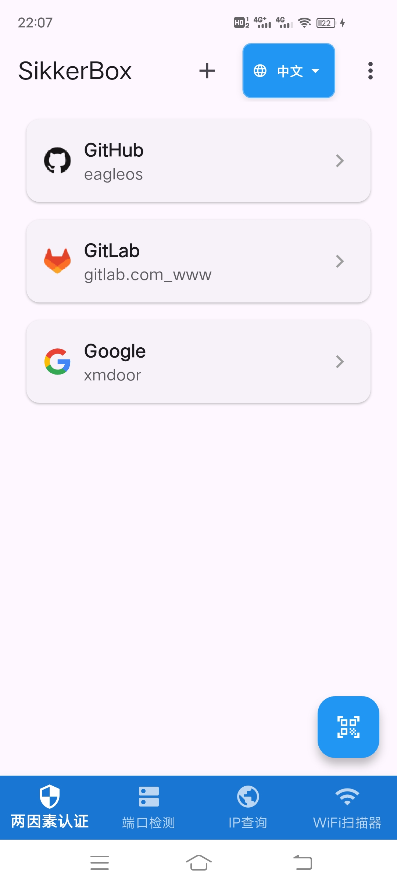
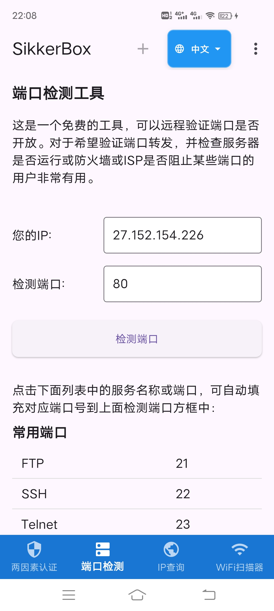
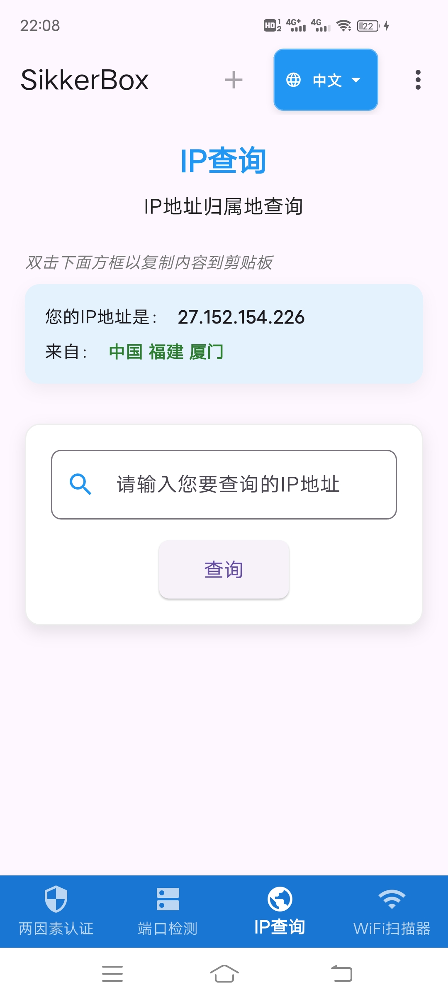
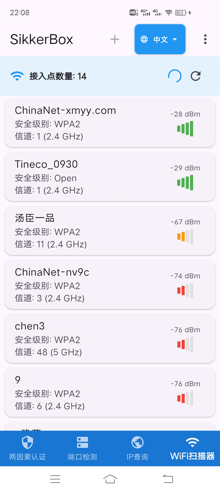
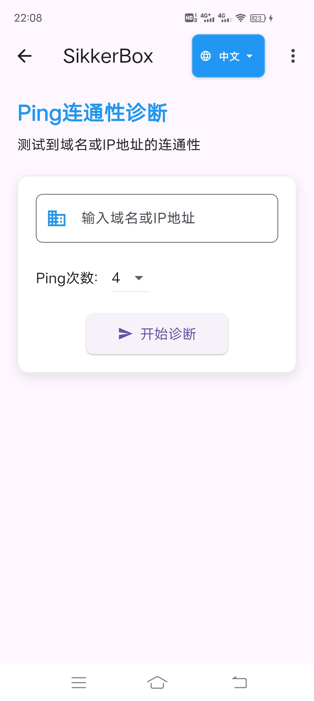
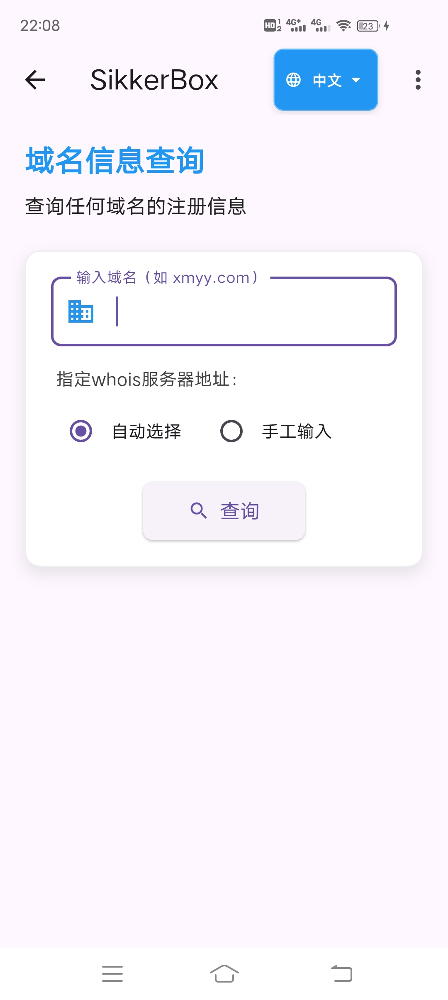
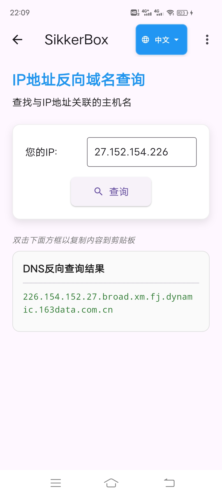
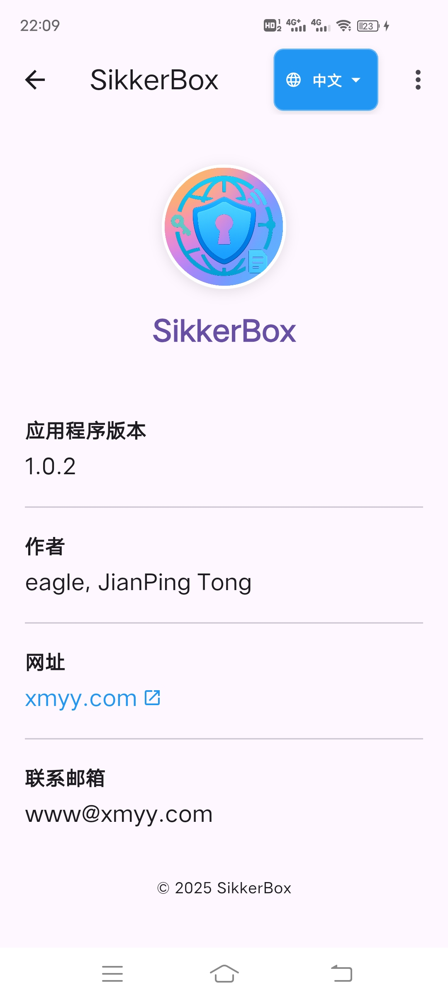

# SikkerBox

[English Documentation](README.md)

## 概述

SikkerBox 是一款综合性安全和网络工具应用，旨在为用户提供一站式的安全工具和网络诊断服务。

`Sikker`源于挪威语，意为`安全`，`Box`代表工具箱。

SikkerBox 具有跨平台兼容性，将两因素认证(2FA)管理与强大的网络诊断工具套件结合在一起。

SikkerBox 采用现代、清晰的UI界面布局和指示，旨在打造成手机上的网络瑞士军刀，为您的数字生活提供一个功能强大且用户友好的安全层解决方案。

## 主要功能

### 两因素认证(2FA)

高度安全可靠的双因素身份验证 (2FA)，支持包括github、gitlab、google等在内的超过 1000 多种提供双因素身份登录验证的网站和在线App。

- **安全账户管理**：通过加密方式安全地存储和管理您的2FA账户
- **二维码扫描**：通过扫描二维码轻松添加新账户
- **手动输入支持**：支持手工输入账户信息
- **基于时间的一次性密码(TOTP)**：生成安全的、符合 RFC 6238 标准的、基于时间的一次性密码（TOTP）/双因素代码 (2FA 代码)，验证码每 30 秒自动更新一次。
- **离线访问**：设置完成后完全离线工作
- **视觉定制**：账户显示服务网站图标，便于识别

### 网络诊断工具

SikkerBox包含一套全面的网络工具：

- **端口检测**：验证任何IP地址上特定端口是否开放或关闭，提供常用端口列表供用户快速一键选择
- **IP地址归属地查询**：确定任何IP地址的地理位置，包含自动获取用户公网IP的功能
- **WiFi扫描器**：分析附近的WiFi网络，包括信号强度、信道和安全信息
- **Ping诊断**：测试到域名或IP地址的连通性
- **Whois查询**：查询任何域名的注册信息
- **DNS反向查询**：查找与IP地址关联的主机名
- **更多功能**：更多功能敬请期待

## 用户体验

- **多语言支持**：完整支持中英文界面切换，所有提示和错误信息均已国际化
- **现代Material设计**：采用Material Design 3的清晰、直观的现代风格界面，注重易用性
- **响应式布局**：针对各种屏幕尺寸进行优化
- **剪贴板集成**：多数功能支持复制粘贴到剪贴板
- **深色模式支持**：在低光环境下舒适查看
- **友好提示**：多数页面提供友好的加载指示器和错误提示

## 技术细节

- **跨平台支持**：适用于 Android、iOS、Windows、macOS、Linux 和 Web
- **安全存储**：所有账户密钥均使用本地 Hive 数据库进行加密和安全存储，不向任何服务器传输数据，所有敏感数据保留在您的设备上
- **低资源占用**：优化电池和内存消耗

## 隐私和安全

SikkerBox优先考虑您的隐私和安全：

- **无需账户**：无需创建账户即可使用所有功能
- **注重隐私**：无分析或跟踪
- **不收集数据**：您的2FA密钥和网络诊断结果保留在您的设备上
- **开放网络API**：网络工具使用开放API进行诊断，不会损害隐私

## 使用场景

- **安全专业人员**：验证网络配置和安全设置
- **IT管理员**：诊断网络问题和验证服务器配置
- **开发人员**：测试应用程序连接和网络功能
- **注重隐私的用户**：管理2FA账户，无需依赖第三方服务

## 系统要求

- Android 5.0 (Lollipop)或更高版本
- iOS 11.0或更高版本
- 桌面版：Windows 10+、macOS 10.14+或带有GTK 3的Linux

## 使用指南

### 安装

目前暂时提供安卓端apk安装包，直接下载apk安装即可。

下载地址：

https://sikkerbox.sourceforge.io

https://github.com/eagleos/sikkerbox

https://www.pgyer.com/VT9KrSgd

## 致谢

- Flutter 团队提供的优秀框架
- 所有使本项目成为可能的软件包维护者

## Github 开启/配置/更换 two-factor authentication (2FA) 双因素认证

### 未开启2FA

1. 下载并安装SikkerBox。

2. 登录Github后，点击页面最右上角的头像，再点击Settings进入设置页面。

3. 再在左侧Access菜单中点击Password and authentication，然后在【Two-factor authentication】区域点击Enable two-factor authentication（启用双重身份验证）按钮。

4. 打开SikkerBox，直接点击app右下角的扫描图标，对准上述Github出现的二维码。扫描成功后自动添加到主界面的账户列表中。

5. 在SikkerBox主界面账户列表中点击对应的Github账号，进去可查看到一次性密码，返回Github页面在二维码下面的Verify the code from the app方框中输入此一次性密码，验证通过后会自动跳转到Download your recovery codes页面，务必下载并将恢复码保存在安全的地方。

6. 然后，点击I have saved my recovery codes按钮，在出现的另一页面中点击Done按钮，即完成开启2FA。

7. 下次如果重新登录Github，或者在另外设备上登录Github要求输入2FA认证吗时，打开SikkerBox，在SikkerBox主界面账户列表中点击对应的Github账号，进去可查看到一次性密码，输入此一次性密码即可登录成功。

### 更换2FA app

1. 下载并安装SikkerBox。

2. 使用原有2FA app成功登录Github后，点击页面最右上角的头像，再点击Settings进入设置页面。

3. 再在左侧Access菜单中点击Password and authentication，然后在【Two-factor authentication】的Two-factor methods区域，点击Authenticator app(Configured)右边的Edit按钮。

4. 打开SikkerBox，直接点击app右下角的扫描图标，对准上述Github出现的二维码。扫描成功后自动添加到主界面的账户列表中。

5. 在SikkerBox主界面账户列表中点击对应的Github账号，进去可查看到一次性密码，返回Github页面在二维码下面的Verify the code from the app方框中输入此一次性密码，验证通过后点击Save保存按钮即可完成2FA app替换。

## FAQ

1. 在SikkerBox中不小心删除账户，无法进行2FA认证登录Github，怎么办？

答：使用Github恢复码成功登录Github，然后使用上述更换2FA app步骤重新绑定SikkerBox即可。

## 贡献者

欢迎参与本app测试，参与者将会在下面表格中列出以示感谢！

| 手机机型               | 测试版本  |   测试结果  | 最新测试时间     | 测试者   |
|--------------------|-------|-------|------------| -------|
| vivo IQOO Neo5     | 1.0.2 |✅| 2025.05.27 |eagle|
| vivo IQOO Neo5 活力版 | 1.0.2 |✅| 2025.05.27 |eagle|

我们一直在努力改进我们的应用！有任何建议或反馈，请告诉我们——我们很乐意听取您的意见！

